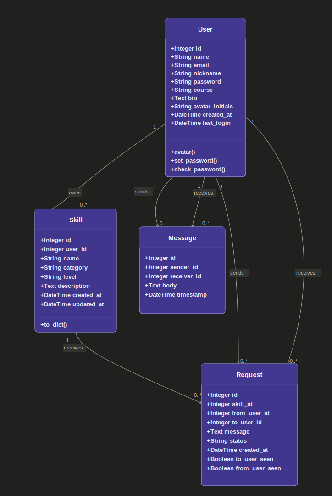

# Database Class Diagram

This class diagram represents the main database models used in the SkillSwap web application. It shows the structure of the `User`, `Skill`, `Request`, and `Message` models, including their key attributes, helper methods, and relationships. The diagram helps explain how students create accounts, post skills, send or receive exchange requests, and communicate through messages after connecting.

## Important Constraints

- `user.email` must be unique.
- `user.nickname` must be unique if provided.
- `skill.user_id` connects each skill to the student who posted it.
- `request.skill_id` connects each request to the requested skill.
- `request.from_user_id` connects the request to the student who sent it.
- `request.to_user_id` connects the request to the student who receives it.
- `request.status` stores the request state, such as pending, accepted, or declined.
- `message.sender_id` connects each chat message to the sender.
- `message.receiver_id` connects each chat message to the receiver.
